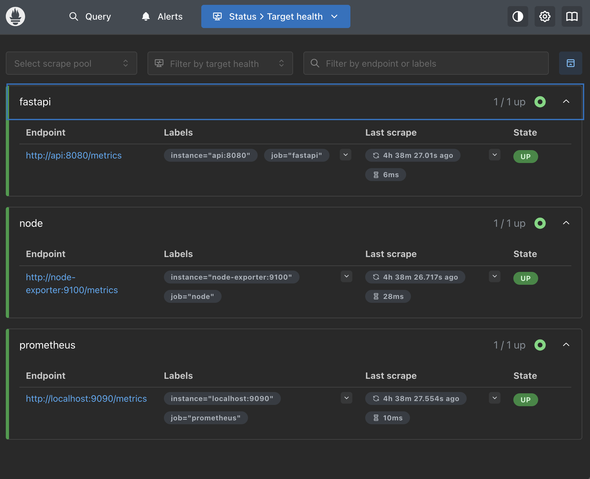
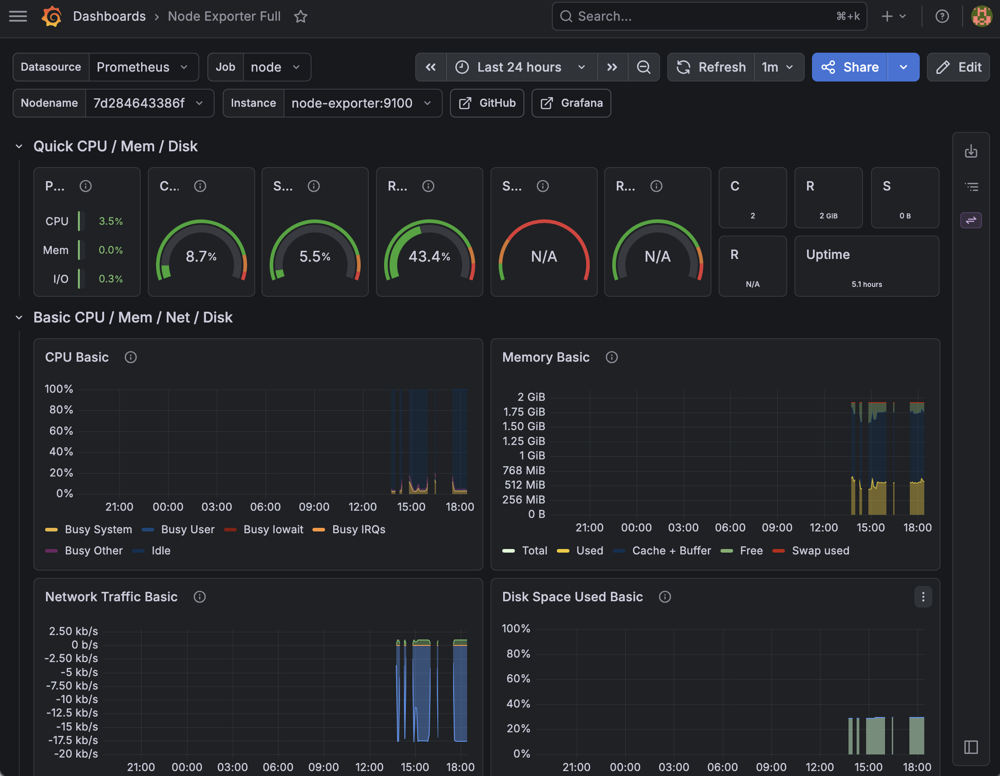
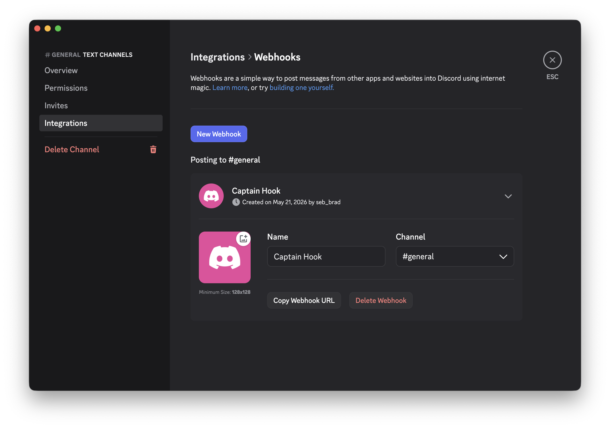
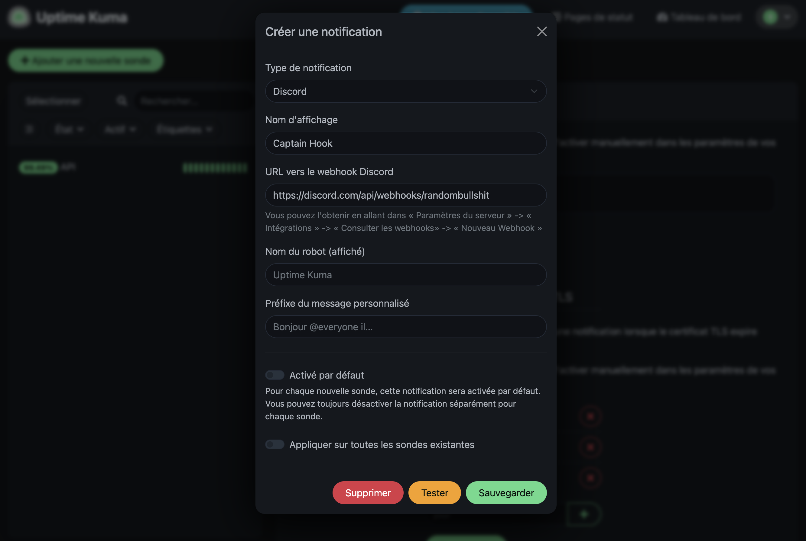
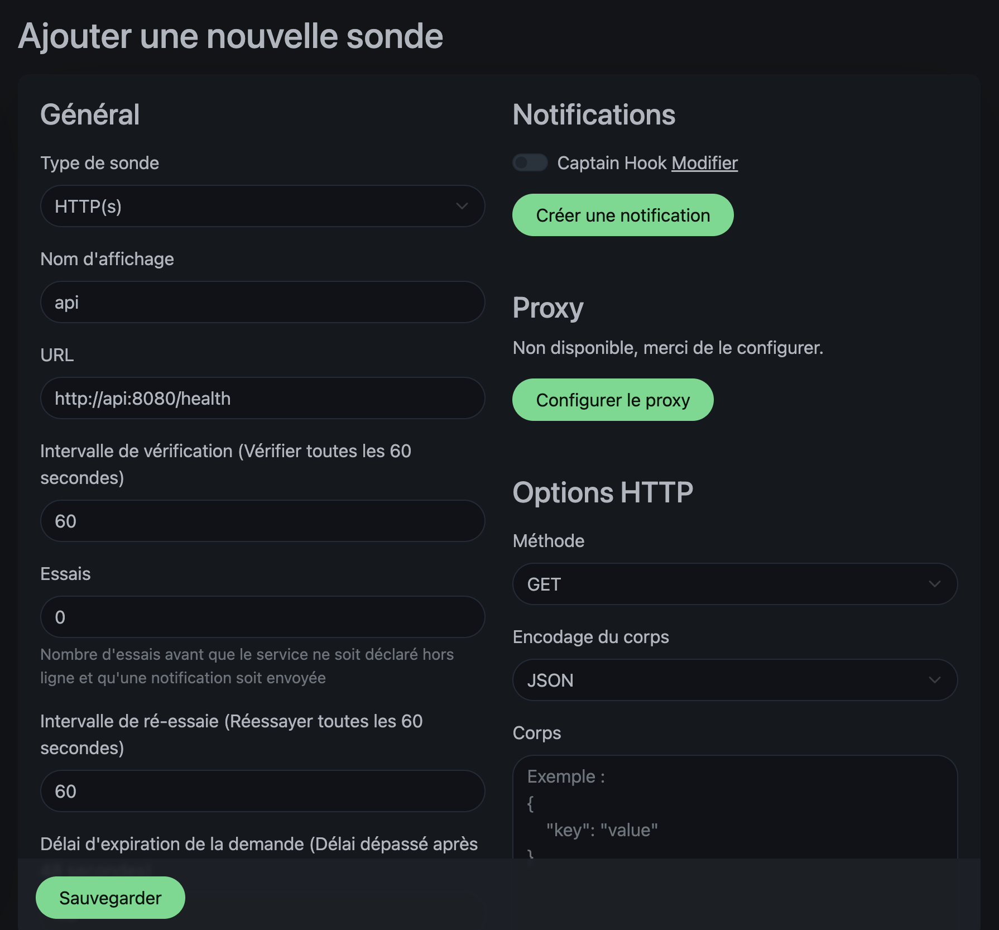

# M5 Brief 3 — Monitoring d'une stack IA conteneurisée

## Services et ports

| Service        | URL externe              | Port interne | Rôle                                                |
|----------------|--------------------------|--------------|-----------------------------------------------------|
| Streamlit      | http://localhost:8501    | 8501         | Frontend qui envoie une couleur à l'API             |
| FastAPI        | http://localhost:8080    | 8080         | API métier ; expose `/health` et `/metrics`         |
| Prometheus     | http://localhost:9090    | 9090         | Collecte et stocke les métriques                    |
| Grafana        | http://localhost:3000    | 3000         | Visualisation (dashboard 1860 auto-importé)         |
| Uptime Kuma    | http://localhost:3001    | 3001         | Monitoring d'accessibilité de l'API                 |
| Node Exporter  | http://localhost:9100    | 9100         | Métriques système (CPU, RAM, disque, réseau)        |

Tous les ports sont paramétrables via le fichier `.env`. Un template est disponible : `.example.env`

---

## Démarrage rapide

```bash
# 1. Cloner le repo
git clone https://github.com/SebDominguez/PCO-ATLAS-Module-5-Brief-3
cd OPCO-ATLAS-Module-5-Brief-3

# 2. Créer le .env à partir de l'exemple et l'adapter
cp .example.env .env
# Édite .env si tu veux changer ports / credentials Grafana

# 3. Lancer toute la stack
docker compose up -d --build

# 4. Suivre les logs
docker compose logs -f
```

Une fois lancé, l'ensemble des services est disponible aux URLs listées plus haut.
Il faut configurer Uptime Kuma via GUI parce que cette daube ne peut pas se configurer avec des env. Voir plus bas.

---

## Vérifications de bon fonctionnement

### 1. L'API répond

```bash
curl http://localhost:8080/health
# {"status":"ok"}

curl -s http://localhost:8080/metrics | head
# # HELP python_gc_objects_collected_total Objects collected during gc
# # TYPE python_gc_objects_collected_total counter
# python_gc_objects_collected_total{generation="0"} 446.0
# python_gc_objects_collected_total{generation="1"} 173.0
# python_gc_objects_collected_total{generation="2"} 0.0
# # HELP python_gc_objects_uncollectable_total Uncollectable objects found during GC
# # TYPE python_gc_objects_uncollectable_total counter
# python_gc_objects_uncollectable_total{generation="0"} 0.0
# python_gc_objects_uncollectable_total{generation="1"} 0.0
# python_gc_objects_uncollectable_total{generation="2"} 0.0

```

### 2. Prometheus scrape les 3 cibles

Ouvrir http://localhost:9090/targets. Les 3 jobs doivent être **UP** :

- `prometheus` → `localhost:9090` (Prometheus se scrape lui-même)
- `fastapi` → `api:8080` (métriques applicatives Python)
- `node` → `node-exporter:9100` (métriques système)



### 3. Grafana affiche le dashboard 1860

Allez sur http://localhost:3000

- login : `$GRAFANA_ADMIN_USER`
- password : `$GRAFANA_ADMIN_PASSWORD`.



### 4. Uptime Kuma surveille l'API

http://localhost:3001. Après la configuration initiale (voir section ci-dessous), tu dois voir le monitor `API` en vert **"En ligne"** avec une disponibilité de 100%.

---

## Configuration d'Uptime Kuma (étape manuelle)

Uptime Kuma ne supporte **pas** la configuration par variables d'environnement pour les monitors et notifications (limitation connue du projet — seules les variables d'infrastructure type port/SSL/DB sont supportées). Les étapes ci-dessous se font une seule fois dans l'UI ; les données sont ensuite persistées dans le volume `./uptime-kuma-data`.

### Étape 1 — Compte admin

À la première visite de http://localhost:3001, crée le compte administrateur (login + mot de passe).


### Étape 2 — Créer le webhook Discord

1. Dans Discord, ouvre les **paramètres** du salon souhaité (icône engrenage)
2. **Intégrations** → **Webhooks** → **Nouveau webhook**
3. Optionnel : renomme-le (par ex. `Uptime Kuma Bot`)
4. **Copier l'URL du webhook**

⚠️ Cette URL est un **secret**. Ne pas la committer dans Git. Elle est uniquement saisie dans l'UI Uptime Kuma et stockée dans le volume persistant.



### Étape 3 — Notification dans Uptime Kuma


1. Dans Uptime Kuma : **Paramètres** (en haut à droite) → **Notifications** → **Configurer une notification**
2. Type : **Discord**
3. Nom : `Discord` (ou ce que tu veux)
4. URL vers le webhook : colle ton URL Discord
5. Cocher **"Default Enabled"** et **"Apply on all existing monitors"**
6. **Tester** → un message doit arriver sur le salon Discord
7. **Sauvegarder**



### Étape 4 — Monitor sur `/health`


1. **Ajouter une nouvelle sonde**
2. Type de sonde : **HTTP(s)**
3. Nom : `API`
4. URL : `http://api:8080/health` (le nom du service Docker, pas `localhost`)
5. Intervalle de vérification : `60` secondes
6. Essais : `3` (pour éviter les faux positifs)
7. Cocher la notification Discord créée à l'étape 3
8. **Sauvegarder**



---

## Test d'alerte Discord

```bash
docker compose stop api
```
*Normalement* Discord devrait gueuler :

>❌ Your service API went down. ❌
>Service Name
>API
>Service URL
>http://api:8080/health
>Time (Europe/Madrid)
>2026-05-21 17:45:30
>Error
>connect EHOSTUNREACH 172.18.0.2:8080
>Today at 17:45

```bash
docker compose start api
```

>✅ Your service API is up! ✅
>Service Name
>API
>Service URL
>http://api:8080/health
>Time (Europe/Madrid)
>2026-05-21 17:46:44
>Ping
>7 ms
>Today at 17:46

---

## Détail des configurations

### `prometheus/prometheus.yml`

Trois jobs de scrape :

```yaml
- job_name: 'fastapi'              # Métriques applicatives Python
  static_configs:
    - targets: ['api:8080']

- job_name: 'prometheus'           # Métriques internes de Prometheus
  static_configs:
    - targets: ['localhost:9090']

- job_name: node                   # Métriques système (CPU, RAM, disque…)
  static_configs:
    - targets: ['node-exporter:9100']
```

Interval de scrape : 5 secondes (`scrape_interval` global).

### `grafana/provisioning/`

Le provisioning Grafana est automatique :

- `datasources/datasource.yml` → déclare Prometheus comme datasource par défaut (`http://prometheus:9090`)
- `dashboards/dashboards.yml` → indique à Grafana de charger tous les JSON présents dans `/etc/grafana/provisioning/dashboards`
- `dashboards/dashboard.json` → le dashboard **1860 "Node Exporter Full"** téléchargé depuis grafana.com

À chaque `docker compose up`, Grafana est déjà configuré, aucun clic n'est nécessaire.

### Endpoint `/metrics` de FastAPI

```python
from prometheus_client import generate_latest, CONTENT_TYPE_LATEST
from starlette.responses import Response

@app.get("/metrics")
async def metrics():
    return Response(generate_latest(), media_type=CONTENT_TYPE_LATEST)
```

### Endpoint `/health` de FastAPI

```python
@app.get("/health")
async def health():
    return {"status": "ok"}
```
